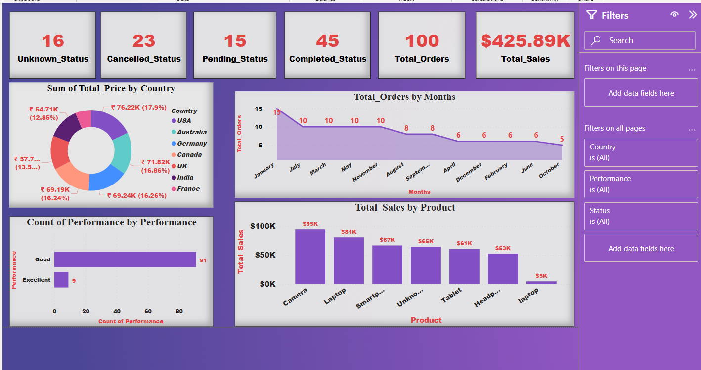

# Sales Dashboard - Power BI

This project showcases an interactive sales dashboard built using Power BI.

## 📊 Features:
- Visualizes total orders, sales, and order statuses
- Sales by country, product, and month
- Performance count visualization
- Filters by Country, Performance, and Status

## 📁 Files:
- `Sales_dashboard.pbix` - Power BI file
- `practice_sales_data.csv` - Dataset used
- `dashboard.png` - Dashboard preview

## 📸 Dashboard Preview:

## 🔗 How to Use:
1. Open the `.pbix` file in Power BI Desktop
2. Explore and interact with the visuals

---

**Built by:** [Masooda Antule]  
**Tools Used:** Power BI, Excel  

